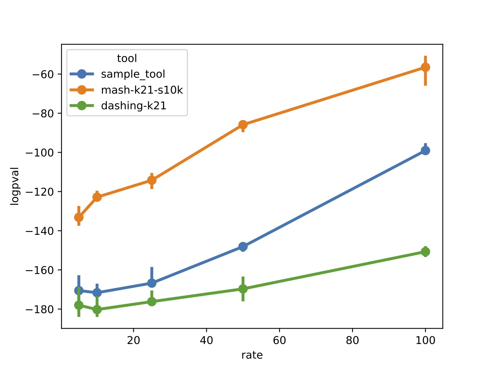

# EvANI


This repository includes the instructions how to run EvANI benchmarking pipeline on the benchmarking datasets. 


### requirements
EvANI framework is a basic python script that performs a Spearman rank correlation test. 

```
conda create -n evani python=3.12
conda activate evani

conda install conda-forge::ete3
conda install conda-forge::seaborn
conda install conda-forge::matplotlib
```
The package ete3 is used to parse phylogenetic trees and calculate tree distances. 


## EvANI benchmarking pipeline


### Step 1: download simulated dataset

First, go to our [zenodo page](https://zenodo.org/records/14579845) and download the simulated dataset
```
Majidian, S., Hwang, S., Zakeri, M., & Langmead, B. (2024). Challenges for sketch-based estimation of evolutionary distance (v0.2.0) [Data set]. Zenodo. https://doi.org/10.5281/zenodo.14579845

```

The dataset includes three evolutionary scenarios: 

1. varying mutation rates including 5,10,25,50,100,
2. varying duplication rates including 0.0000,0.0005, 0.0010, 0.0020, 
3. varying rates of lateral gene transfer (LGT), also known as horizontal gene transfer (HGT) including 0.0001, 0.0005, 0.0010, 0.0020. Note that for lgt=0 you could use duplication=0 dataset.

For each stud/rate, there are five replicates of evolution simulation. Each case contain 15 genomes (DNA fasta files).


### Step 2: run your ANI tool 

Run your ANI tool on the simulated datasets and report the results in TSV files. The format of the file name is `study_rate_replicate.tsv`  e.g. `duplication_0.0005_2.tsv`. 
We provided a folder `sample_tool` including the outputs of a sample tool. 


### Step 2: run EvANI benchmarking 
First, clone this github repo:

```
git clone git@github.com:sinamajidian/EvANI.git

```

This provides you with the python script and the precomputed simulated dataset. Make sure you have installed the requirements.
The code has two positional arguments: the folder name where the TSV files of ANI values are stored, and one of the studies `duplication`, `mutation` or `lgt`. 


Now run it as 

```
python EvANI.py sample_tool mutation

```

This will output two figures in PDF, one for log p-values and one for statistics versus the rates.  For the sample_tool, the output will be 


<div align="center">
  
</div>


Sample tool here is [FastANI](https://github.com/ParBLiSS/FastANI) with Min Fraction of genome shared =0.1 and fragment length =3000.


## Note on EvANI benchmarking datasets


For generating simulated data, we benefited from [ALF simulator]((https://github.com/DessimozLab/ALF)) and ran locally using [the script](https://github.com/sinamajidian/EvANI/blob/main/scripts/run_ALF_locally.sh), based on the [parameter files](https://github.com/sinamajidian/EvANI/blob/main/scripts/ALF_sim-params.drw). Note that small dataset can also be generated online [here](http://alf.cs.ucl.ac.uk/ALF/).   Simulated datasets are freely available on our [zenodo page](https://zenodo.org/records/14579845).


The bash script to download the real genomes are provided in the folder `real_data`. For example for the Caldisericia clade, we have  a bash script and the phylogeny in newick format [here](https://github.com/sinamajidian/EvANI/tree/main/real_data/c__Caldisericia)
The bash script includes command line to download the NCBI genomes using esearch

```
wget  `esearch -db assembly -query ${i} | esummary | xtract -pattern DocumentSummary -element FtpPath_GenBank | awk -F"/" '{print $0"/"$NF"_genomic.fna.gz"}'`  -O ${i}.fna.gz 
```

For real data we used the GTDB tree, available [here](https://data.gtdb.ecogenomic.org/releases/release202/202.0/). 

We also used [ete3](https://github.com/etetoolkit/ete/tree/3.0) to download the [NCBI taxanomy](https://www.ncbi.nlm.nih.gov/Taxonomy/Browser/wwwtax.cgi) in Python.
```
import ete3
ncbi = ete3.NCBITaxa() 
ncbi_sub_tree = ncbi.get_topology(ncbi_taxon_list)
```


